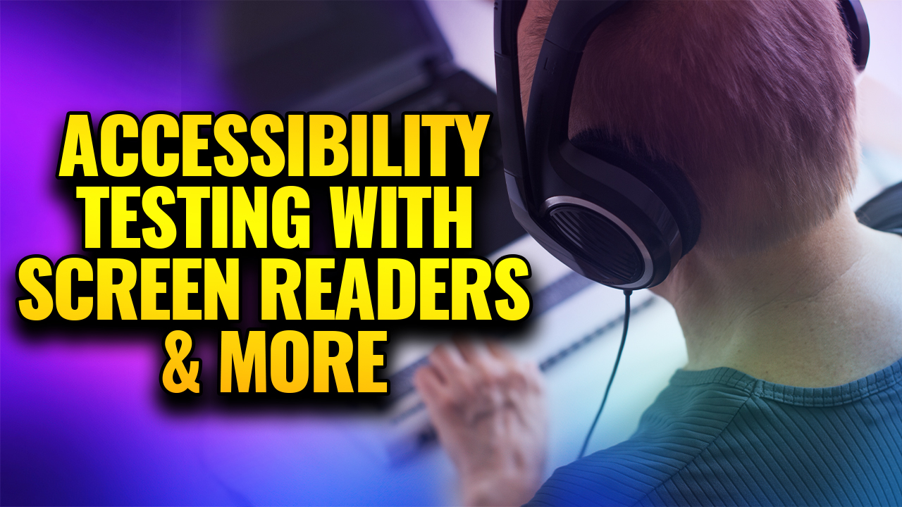

# Louisville .NET Meetup March 2024

## Accessibility Testing with Screen Readers & More

- **Date**: August 22, 2024
- **Time**: 6:30 PM EDT
- **Location**: Slingshot (700 N Hurstbourne Pkwy, Louisville, KY)
- **Meetup.com**: [Accessibility Testing with Screen Readers & MoreI](https://www.meetup.com/louisville-dotnet/events/299473374/)

### Description

Accessibility Testing is an interesting process involving a mixture of automated and manual testing methods with a variety of tools. You may have an Accessibility test plan together, but now you need the tools to put it to use.

In this talk, we'll touch on some of the ways we can use screen readers in a mobile and desktop environment to identify how accessible things are. Additionally, we will touch on a few other tools that can be used, like browser extensions, bookmarklets, and desktop applications.

### Speakers

#### Erissa Duvall

Erissa Duvall is an Accessibility focused international speaker and engineer. She got her professional start in Accessibility while working in IT at the American Printing House for the Blind in 2015. Since then she has expanded upon her knowledge of Accessibility due to her determination to help others.

To that end, she focuses on finding ways to use her personal and professional disability / accessibility experience to spread awareness through speaking, mentoring, and online community efforts. She uses her passion for accessibility to reveal the harmful impact of inaccessible attitudes, policies, and environments, and how much power we all have to do something about it.

[Blog](https://davidgiard.com/)

### Resources

- Available Afterwards